# Refactored Architecture 2026-03-28

## Runtime Entry Architecture

```mermaid
flowchart TD
    MC["main.cpp"] --> AC["ControllerApp"]
    AC --> CCR["ControllerCompositionRoot"]
    CCR --> CCF["ControllerComponentFactory"]
    CCR --> CCS["composition_support helpers"]
    CCR --> CPS["plane_support helpers"]
    CCR --> CRMS["read_model_support helpers"]
    CCR --> CSV["serve_support helpers"]
    CCR --> CLS["ControllerLanguageSupport"]
    CCR --> CSF["ControllerSchedulerServiceFactory"]
    CCR --> CTS["ControllerTimeSupport"]
    CCF --> CLI["ControllerCli / HTTP services"]

    ML["main.cpp"] --> LA["LauncherApp"]
    LA --> LCR["LauncherCompositionRoot"]
    LCR --> LR["Run / Install / Doctor services"]

    MH["main.cpp"] --> HA["HostdApp"]
    HA --> HCR["HostdCompositionRoot"]
    HCR --> HB["DefaultHttpHostdBackendSupport"]
    HCR --> HOS["DefaultHostdObservationSupport"]
    HCR --> HASUP["DefaultHostdAssignmentSupport"]
    HCR --> HCA["HostdCliActions"]
    HCR --> HOBS["HostdObservationService"]
    HCR --> HAS["HostdAssignmentService"]
    HCR --> HCTS["controller_transport_support helpers"]
    HCR --> HTS["telemetry_support helpers"]

    MI["main.cpp"] --> IA["InferApp"]
    IA --> ISS["InferSignalService"]
    IA --> LLE["LlamaLibraryEngine"]
    IA --> LR["LocalRuntime"]
    IA --> IMCS["model_cache_support helpers"]
    IA --> ISSUP["status_support helpers"]
    LR --> LHSI["LocalHttpServer (inference)"]
    LR --> LHSG["LocalHttpServer (gateway)"]
    LR --> IRS["runtime_support helpers"]

    MW["main.cpp"] --> WA["WorkerApp"]
    WA --> WEH["WorkerEngineHost"]

    CS["ControllerStore"] --> AR["AuthRepository"]
    CS["ControllerStore"] --> ASR["AssignmentRepository"]
    CS["ControllerStore"] --> DSR["DesiredStateRepository"]
    CS["ControllerStore"] --> DSC["DesiredStateSqliteCodec"]
    CS["ControllerStore"] --> DRR["DiskRuntimeRepository"]
    CS["ControllerStore"] --> ER["EventRepository"]
    CS["ControllerStore"] --> NAR["NodeAvailabilityRepository"]
    CS["ControllerStore"] --> OR["ObservationRepository"]
    CS["ControllerStore"] --> PR["PlaneRepository"]
    CS["ControllerStore"] --> RHR["RegisteredHostRepository"]
    CS["ControllerStore"] --> SR["SchedulerRepository"]
    CS["ControllerStore"] --> SS["SqliteStatement"]
    CS["ControllerStore"] --> CSS["sqlite_store_schema helpers"]
    CS["ControllerStore"] --> SSS["sqlite_store_support helpers"]
```



## Current Ownership Map

### Controller

- `ControllerApp`
  owns CLI bootstrap and local-vs-remote command entry decision
- `ControllerCompositionRoot`
  owns object graph assembly
- `ControllerComponentFactory`
  owns controller service/http factory assembly seam behind the composition root
- `composition_support::*`
  owns reusable controller composition helpers for request parsing, response shaping, event logging, and plane-scoped observation checks
- `plane_support::*`
  owns plane-oriented service builders and mutation/host-registry wiring seams behind the composition root
- `read_model_support::*`
  owns read-model-oriented service and HTTP/CLI builder seams behind the composition root
- `serve_support::*`
  owns HTTP serve-time router/server assembly for the controller process
- `ControllerLanguageSupport`
  owns interaction language normalization and response-language policy text
- `ControllerTimeSupport`
  owns controller-facing timestamp formatting and SQL timestamp helpers
- `ControllerSchedulerServiceFactory`
  owns scheduler service creation seam for HTTP orchestration

### Launcher

- `LauncherApp`
  owns argv handoff into launcher composition
- `LauncherCompositionRoot`
  owns launcher object graph and command dispatch

### Hostd

- `HostdApp`
  owns hostd entrypoint handoff
- `HostdCompositionRoot`
  owns hostd object graph assembly
- `DefaultHttpHostdBackendSupport`
  owns default controller/backend transport adapter
- `DefaultHostdObservationSupport`
  owns default observation support adapter
- `DefaultHostdAssignmentSupport`
  owns default assignment support adapter
- `HostdCliActions`
  owns CLI-to-service orchestration
- `HostdObservationService`
  owns observed-state reporting
- `HostdAssignmentService`
  owns assignment application orchestration
- `controller_transport_support::*`
  owns controller HTTP transport, payload parsing and payload shaping used by hostd adapters
- `telemetry_support::*`
  owns host runtime inspection, process status loading, telemetry collection and eviction verification seams

### Infer

- `InferApp`
  remains the infer runtime entry owner
- `InferSignalService`
  owns process signal registration and stop request tracking
- `LlamaLibraryEngine`
  owns local llama.cpp model loading and token generation
- `LocalHttpServer`
  owns single-port HTTP serve loop for local inference and gateway traffic
- `LocalRuntime`
  owns local runtime lifecycle, readiness tracking, and dual-server startup/shutdown
- `RuntimeConfig`
  owns infer runtime configuration value model used across runtime components
- `runtime_support::*`
  owns shared HTTP/runtime helper seams currently used by extracted infer runtime components
- `status_support::*`
  owns status, doctor and gateway-plan command handlers for infer CLI flow
- `model_cache_support::*`
  owns preload/cache/switch-model command handlers and model-cache registry updates
- public infer app header now lives in `include/`, not `src/`

### Common State

- `AuthRepository`
  owns authentication/user/session/WebAuthn persistence operations behind `ControllerStore`
- `AssignmentRepository`
  owns host-assignment queueing, claim/transition, retry, and plane-level supersede persistence operations behind `ControllerStore`
- `DesiredStateRepository`
  owns desired-state replace transactions, desired-state row graph loading, desired-generation reads, and rebalance-iteration reads behind `ControllerStore`
- `DesiredStateSqliteCodec`
  owns desired-state-adjacent JSON serialization/deserialization and enum parsing used by SQLite persistence
- `DiskRuntimeRepository`
  owns disk runtime-state upsert/load persistence operations behind `ControllerStore`
- `EventRepository`
  owns event-log append/load persistence operations behind `ControllerStore`
- `NodeAvailabilityRepository`
  owns node-availability override persistence operations behind `ControllerStore`
- `ObservationRepository`
  owns host-observation upsert/load persistence operations behind `ControllerStore`
- `PlaneRepository`
  owns plane row load/update/delete persistence operations behind `ControllerStore`
- `RegisteredHostRepository`
  owns registered-host persistence operations behind `ControllerStore`
- `SchedulerRepository`
  owns rollout-action and scheduler runtime persistence operations behind `ControllerStore`
- `SqliteStatement`
  owns prepared-statement lifecycle and bind/step operations for SQLite-backed persistence
- `sqlite_store_schema::*`
  owns schema bootstrap and migration/backfill orchestration for `ControllerStore`
- `sqlite_store_support::*`
  owns shared SQLite row/column utility helpers and lazy schema-column migration helpers used by `ControllerStore`

### Worker

- `WorkerApp`
  owns bootstrap and top-level exception boundary
- `WorkerEngineHost`
  owns worker runtime loop

## Directory-Level Target Shape

```text
controller/
  include/app/
    controller_app.h
    controller_component_factory.h
    controller_component_factory_support.h
    controller_composition_support.h
    controller_http_service_support.h
    controller_plane_support.h
    controller_read_model_support.h
    controller_serve_support.h
    controller_language_support.h
    controller_scheduler_service_factory.h
    controller_time_support.h
    controller_composition_root.h
  src/app/
    controller_app.cpp
    controller_component_factory.cpp
    controller_component_factory_support.cpp
    controller_composition_support.cpp
    controller_http_service_support.cpp
    controller_plane_support.cpp
    controller_read_model_support.cpp
    controller_serve_support.cpp
    controller_language_support.cpp
    controller_scheduler_service_factory.cpp
    controller_time_support.cpp
    controller_composition_root.cpp

hostd/
  include/app/
    hostd_app.h
    hostd_composition_root.h
    hostd_bootstrap_model_support.h
    hostd_cli_actions.h
    hostd_app_support.h
    hostd_local_state_support.h
  include/backend/
    default_http_hostd_backend_support.h
  include/observation/
    default_hostd_observation_support.h
  include/state_apply/
    default_hostd_assignment_support.h
  src/app/
    hostd_app.cpp
    hostd_composition_root.cpp
    hostd_bootstrap_model_support.cpp
    hostd_cli_actions.cpp
    hostd_local_state_support.cpp
  src/backend/
    default_http_hostd_backend_support.cpp
  src/observation/
    default_hostd_observation_support.cpp
  src/state_apply/
    default_hostd_assignment_support.cpp

runtime/infer/
  include/app/
    infer_app.h
    infer_command_line.h
    infer_cli_output_support.h
  include/platform/
    infer_signal_service.h
  include/http/
    infer_http_types.h
    local_http_server.h
  include/runtime/
    infer_control_support.h
    infer_runtime_types.h
    infer_runtime_support.h
    local_runtime.h
    llama_library_engine.h
  src/
    infer_app.cpp
    main.cpp
  src/app/
    infer_command_line.cpp
    infer_cli_output_support.cpp
  src/http/
    local_http_server.cpp
  src/platform/
    infer_signal_service.cpp
  src/runtime/
    infer_control_support.cpp
    local_runtime.cpp
    llama_library_engine.cpp

common/
  include/comet/state/
    auth_repository.h
    assignment_repository.h
    desired_state_repository.h
    desired_state_sqlite_codec.h
    disk_runtime_repository.h
    event_repository.h
    node_availability_repository.h
    observation_repository.h
    plane_repository.h
    registered_host_repository.h
    scheduler_repository.h
    sqlite_statement.h
    sqlite_store_schema.h
    sqlite_store_support.h
  src/state/
    auth_repository.cpp
    assignment_repository.cpp
    desired_state_repository.cpp
    desired_state_sqlite_codec.cpp
    disk_runtime_repository.cpp
    event_repository.cpp
    node_availability_repository.cpp
    observation_repository.cpp
    plane_repository.cpp
    registered_host_repository.cpp
    scheduler_repository.cpp
    sqlite_statement.cpp
    sqlite_store_schema.cpp
    sqlite_store_status_codec.cpp
    sqlite_store_support.cpp

runtime/worker/
  include/
    worker_app.h
    worker_engine_host.h
  src/
    worker_app.cpp
    worker_engine_host.cpp
    main.cpp
```

## Next Architecture Cut

Чтобы довести архитектуру до правил документа полностью, следующий целевой shape должен быть таким:

- `hostd_app.cpp` уже отдал bootstrap model orchestration в `HostdBootstrapModelSupport` и режется дальше на execution/CLI, telemetry и disk/controller transport owners
- `infer_app.cpp` распадается дальше из giant command/orchestration file на несколько named runtime command owners
- `infer_app.cpp` теряет оставшиеся orchestration helper-функции после переноса `control_support::*`
- `controller_composition_root.cpp` после выноса `ControllerComponentFactory`, `composition_support::*`, `http_service_support::*`, `plane_support::*`, `read_model_support::*`, `serve_support::*` и `component_factory_support::*` стал thin root; следующий фронт там уже не composition file, а callback-bag service APIs
- `sqlite_store.cpp` завершён как thin façade над extracted repositories/support слоями
